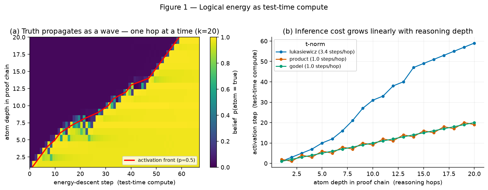

# ThermoLogic, in plain English

*A friendly companion to the [technical report](PAPER.md). No maths required.*
**Teo Qing Cong Eugene** · [linkedin.com/in/eugene-teo](https://www.linkedin.com/in/eugene-teo)

---

## The problem in one sentence

Today's AI models are brilliant at *guessing what sounds right*, but nothing
inside them stops an answer from being *logically impossible* — which is a big
reason they hallucinate.

## The idea in one picture

Imagine every possible answer as a spot on a landscape.

- **Valleys** = answers that obey the rules (logically valid).
- **Hills** = answers that break the rules (contradictions).

We build the landscape so that **breaking a rule is literally uphill** — the more
an answer contradicts itself, the higher and steeper the hill. Then "thinking"
becomes simple physics: let the answer **roll downhill** until it settles in a
valley. When it stops, it's guaranteed to obey the rules.

That "height" is what we call **energy**. Valid = low energy. Contradiction =
high energy. We call the project **ThermoLogic** because reasoning starts to look
like thermodynamics.

## How we made logic "rollable"

Normal logic is all-or-nothing (true/false), which a neural network can't learn
from — there's nothing to nudge. So we use **fuzzy logic**: truth becomes a dial
from 0 to 1. Now "how badly are you breaking this rule?" has a smooth answer, and
the AI can be nudged toward valid answers, one small step at a time. That's the
whole trick — turning hard yes/no rules into a smooth slope you can slide down.

## The three things we found

1. **You can *repair* a bad answer without any training labels.** Give the system
   an answer that breaks the rules, and let it roll downhill — it fixes itself
   into the nearest valid answer. On brand-new inputs it had never seen, this
   lifted logical validity from "often wrong" to "essentially always consistent."

2. **A plain AI can be just as *accurate* — but it can't tell when it's wrong.**
   This is the honest headline. A normal neural net matched ours on accuracy. The
   difference: our energy number is a **built-in lie detector** — it flags an
   answer as inconsistent *without needing the correct answer to compare against*,
   and then fixes it. A normal net just gives you a confident wrong answer.

3. **Deeper reasoning costs more "thinking time," predictably.** If an answer
   requires a chain of reasoning (A implies B implies C…), the truth spreads
   through the chain **one link at a time** as the answer rolls downhill. Twice
   the reasoning depth ≈ twice the thinking steps. It's a clean, measurable
   version of "harder questions need more thinking."

*Left: truth spreading link-by-link through a reasoning chain as we spend more
"thinking steps." Right: deeper reasoning takes proportionally longer.*

## Why this matters (the product)

Anywhere an AI produces a **structured answer that must obey hard rules** — a
software configuration, an insurance decision, a filled-in form, a data record —
you can bolt ThermoLogic on to:

- **Score** how much the answer breaks your rules (a trust/consistency signal),
- **Flag** exactly which rules it broke, and
- **Repair** it to the nearest valid answer — with a "thinking budget" you set.

We built a small demo: a SaaS plan configurator. A customer on the *Pro* plan asks
for *single sign-on* (an Enterprise-only feature). ThermoLogic instantly flags it,
names the exact rule, and repairs the request to the nearest valid setup — keeping
the features that *were* allowed. No hand-written validation code, no training
data — just the rules.

## What this is (and isn't)

- **It is:** a clean, working proof-of-concept and a small usable tool, showing
  how hard logic and soft neural networks can be fused with nothing but the same
  gradient-descent that powers modern AI.
- **It isn't:** a finished product, a language-model upgrade, or a claim to have
  "solved" hallucination. It works today on structured outputs with clear rules.
  Scaling the same idea toward language models is the exciting road ahead — but
  that's the vision, not a result.

---

**Try it:** the interactive playground (drag a "thinking" slider and watch a
contradiction repair itself) · **Read it:** the [technical report](PAPER.md) ·
**Use it:** `pip install -e .` then `from thermologic import LogicEnergy`.
