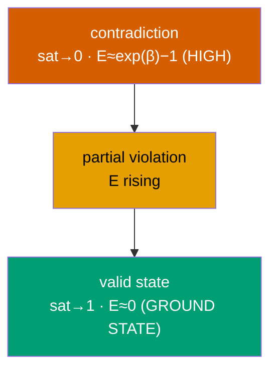
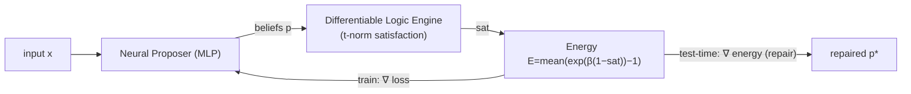

# Logical Energy as Test-Time Compute: Scoring and Repairing Neural Outputs with a Differentiable Theorem-Proving Energy-Based Model

**Teo Qing Cong Eugene** · [linkedin.com/in/eugene-teo](https://www.linkedin.com/in/eugene-teo)

*Technical report · Project ThermoLogic · reproducible PyTorch prototype*

---

> **Scope & honesty note.** This is an engineering *technical report / proof-of-
> concept*, not a peer-reviewed claim of a new paradigm. It builds directly on
> established neuro-symbolic work (Logic Tensor Networks, DeepProbLog, Semantic
> Loss, Neural Theorem Provers, and analyses of differentiable fuzzy operators —
> see §9). Every number below is produced by the accompanying code with fixed
> seeds. The contribution is (i) a clean, from-scratch, fully-reproducible
> implementation, and (ii) two small original observations about **test-time
> energy repair** and **how reasoning depth maps to test-time compute**.

---

## Abstract

Neural models trained by maximum likelihood have no internal mechanism that
forbids logically inconsistent outputs. We present **Project ThermoLogic**, a
compact PyTorch system that fuses **Differentiable Theorem Proving** (relaxing
discrete rules into fuzzy-logic *t-norms*) with an **Energy-Based Model**: a
belief state's energy is `~0` when it satisfies every rule and grows
*exponentially* as rules are violated. A small MLP (the *Neural Proposer*)
proposes probabilistic truth values; the energy then acts as a differentiable
*prover*. On an 11-atom benchmark with a genuine world-level train/test split we
report three findings. **(1)** A plain supervised network matches ThermoLogic on
raw accuracy (`0.955` vs `0.970`) but its outputs are logically *inconsistent*
(mean energy `0.95`); the energy layer's value is a **label-free consistency
guarantee** (energy `0.001`), not accuracy. **(2)** **Test-time energy repair** —
gradient descent on the energy — turns an inconsistent output on *unseen* inputs
into a valid one (`0.935 → 0.971` accuracy, energy `0.90 → 0.0006`), a form of
inference-time reasoning. **(3)** In a proof chain, truth propagates through the
energy **one hop at a time**: inference cost grows *linearly with reasoning
depth*, and the choice of t-norm sets the propagation speed (`~3.4` descent steps
per hop for Łukasiewicz vs `~1.0` for Gödel/Product). We package the mechanism as
a small library (`thermologic`) that **scores** and **repairs** any model's
structured output against hard rules at a controllable compute budget.

**Keywords:** neuro-symbolic AI, energy-based models, differentiable logic,
t-norms, test-time compute, constraint satisfaction, guardrails, PyTorch.

---

## 1. Introduction

A maximum-likelihood objective rewards fitting the data distribution; it never
assigns *infinite* cost to a self-contradictory output. Symbolic systems are the
opposite — rigorously consistent but non-differentiable, so they do not compose
with gradient learning. Project ThermoLogic asks a narrow, testable question:

> *Can a neural network's continuous, probabilistic beliefs be constrained — and
> repaired — by discrete logical rules, using only backpropagation?*

The organizing metaphor is thermodynamic:

```
logical validity ⇔ low energy (ground state)    contradiction ⇔ high energy
```

The network explores the belief space; the energy makes invalid configurations
expensive. Crucially, the energy is differentiable, so it can be minimized **at
training time** (as a loss) *and* **at test time** (as an inference procedure
that repairs a given output).

### 1.1 Contributions

1. A clean, fully-reproducible **DTP + EBM** implementation with three t-norm
   families and residuated implications (`thermologic` package, 18 unit tests).
2. A **label-free consistency signal + repair** operator, and the empirical
   finding that a plain supervised net matches on accuracy but *not* consistency
   — so the energy's value is reliability, not accuracy (§5.3).
3. **Test-time energy repair** framed as inference-time compute, with a measured
   compute–consistency curve (§5.2).
4. The **truth-propagation wave**: reasoning depth ↦ test-time compute is linear,
   and the t-norm sets the speed (§5.1).
5. A small **product** — `LogicEnergy.score()/repair()` — and a worked config-
   validation use case.

---

## 2. Background and related work

**Fuzzy logic & t-norms.** Truth values relax to `[0,1]`; conjunction becomes a
*t-norm* `⊗`, implication its *residuum*. van Krieken et al. (2022) analyze which
operators yield usable gradients — motivating our Łukasiewicz default.

**Neuro-symbolic learning.** Logic Tensor Networks (Badreddine et al., 2022),
DeepProbLog (Manhaeve et al., 2018), Semantic Loss (Xu et al., 2018), and Neural
Theorem Provers (Rocktäschel & Riedel, 2017) all inject logic into learning,
typically as a **training-time** loss or probabilistic program. **Energy-based
models** (LeCun et al., 2006) shape a scalar energy landscape. This report's
angle — using a differentiable-logic energy as a **test-time** repair/inference
procedure, and characterizing its compute-vs-depth behaviour — is the less-
explored combination.

---

## 3. Method

### 3.1 Discrete logic → differentiable tensors

Throughout, an **atom** is a single atomic proposition — one true/false statement
such as `Rain` or `sso_enabled` (the standard logic term for the smallest unit of
a rule; unrelated to physics atoms despite the thermodynamic framing).

Let `p_i ∈ [0,1]` be the belief that atom `i` is true. A literal's truth is `p_i`
(or `1−p_i` if negated). A Horn rule `L₁ ∧ … ∧ Lₖ → C` scores as
`sat = residuum( ⊗ᵢ truth(Lᵢ), truth(C) ) ∈ [0,1]`.

**Table 1 — Operator mapping per t-norm.**

| Discrete | Product | Łukasiewicz (default) | Gödel |
|---|---|---|---|
| `¬a` | `1−a` | `1−a` | `1−a` |
| `a ∧ b` | `a·b` | `max(0, a+b−1)` | `min(a,b)` |
| `a ⇒ c` (residuum) | `1 if a≤c else c/a` | `min(1, 1−a+c)` | `1 if a≤c else c` |

**Modus ponens is emergent:** with the antecedent believed (`≈1`),
`residuum(1, p_C)=p_C`, so `sat→1` *requires* `p_C→1`. The gradient of the energy
w.r.t. `p_C` is what derives `C`. Łukasiewicz is the default: its residuum
`min(1,1−a+c)` is piecewise-linear with bounded, division-free gradients.

### 3.2 The energy (EBM)

Per-rule energy `E_r = exp(β(1−sat_r)) − 1`; total `E = mean_r E_r`. Valid ⇒
`E=0`; contradictions grow exponentially with inverse-temperature `β`.



### 3.3 Training objective and test-time repair

Training loss (amortized inference): `L = w_sup·BCE(p_causes, y) + w_rule·E +
w_par·mean(p_derived)`; supervision anchors observed atoms, energy constrains the
rest, parsimony selects the minimal model.

**Test-time repair (the key operator).** Given *any* belief state `p` (e.g. a
model's output on a novel input), hold trusted atoms fixed and run gradient
descent on `E` over the rest, in logit space:

```
p* = argmin_{free atoms}  E(p)      # iterative, label-free logical inference
```

Because minimizing `E` enforces every rule, this *repairs* an inconsistent output
to the nearest valid state. The number of steps is a **compute budget**.



---

## 4. Benchmark

**Table 2 — Expanded knowledge base.** 11 atoms, 9 rules, **18** distinct
logically-consistent worlds; `294 / 2048` full Boolean worlds are consistent.

| Group | Atoms | Rules (sample) |
|---|---|---|
| Causes (5, observed) | Rain, Sprinkler, Cold, HeaterOn, Windy | `Rain→¬Sprinkler`, `HeaterOn→¬Cold` (constraints) |
| Derived (6, inferred) | Cloudy, WetGround, Slippery, Ice, Warm, Chilly | `Rain→Cloudy`, `Rain/Sprinkler→WetGround`, `WetGround→Slippery`, `Cold∧WetGround→Ice`, `HeaterOn→Warm`, `Windy∧Cold→Chilly` |

Ground truth is the forward-chained minimal model. We **hold out entire worlds**:
train on 12 worlds, test on 6 the model has *never seen*. Inputs are noisy
encodings of the cause atoms (σ=0.12) plus 3 distractor dims.

---

## 5. Experiments

All numbers regenerate via `python experiments.py` (seeds fixed; CPU-deterministic).

### 5.1 Logical energy as test-time compute (the propagation wave)

Starting from a state where a cause is true but a chain `A₀→A₁→…→A_k` of derived
atoms is false, test-time energy descent (plain SGD) turns atoms on **one hop at
a time** — atom depth `d` activates only after `d−1`. Activation step is a
strictly monotone, near-linear function of depth; the t-norm sets the slope.

**Figure 1 — Truth propagates as a wave; inference cost is linear in reasoning depth.**


**Table 3 — Propagation speed (k=20 chain).**

| t-norm | steps per reasoning hop | wave monotonic? |
|---|---|---|
| Łukasiewicz | `3.38` | yes |
| Product | `0.98` | (near) |
| Gödel | `1.00` | yes |

*Caveats (honest):* the clean monotone wave requires momentum-free SGD (Adam's
momentum accelerates and distorts the tail), and because energy is a *mean* over
rules, longer chains propagate slightly slower per step. The robust claim is the
within-chain monotone wave and linear depth-cost at fixed length.

### 5.2 Generalization and test-time repair

On worlds never seen in training, a single feed-forward pass generalizes only
partially and leaves outputs logically *inconsistent* (high energy). Repair fixes
them.

**Figure 2 — Amortized inference is inconsistent on unseen worlds; repair fixes it.**


**Table 4 — Generalization (mean ± std, 5 seeds).**

| Split | Derived accuracy | Mean energy |
|---|---|---|
| Seen worlds | `0.995 ± 0.010` | `~0` |
| Unseen (feed-forward) | `0.935 ± 0.022` | `0.898 ± 0.178` |
| **Unseen (+ repair)** | **`0.971 ± 0.007`** | **`0.001 ± 0.000`** |
| Cause recovery (unseen) | `0.981 ± 0.004` | — |

Repair is a **compute knob**: more descent steps → lower energy and higher
accuracy, plateauing around 50 steps.

**Figure 3 — Test-time compute vs. energy and accuracy.**


| Budget (steps) | 0 | 10 | 30 | 50 | 100 | 200 |
|---|---|---|---|---|---|---|
| Accuracy | 0.935 | 0.950 | 0.973 | 0.974 | 0.975 | 0.975 |
| Energy | 0.980 | 0.591 | 0.033 | 0.0014 | 0.0008 | 0.0004 |

### 5.3 Baselines — the value is consistency, not accuracy

A **plain supervised network** (BCE on all atoms, no logic) reaches `0.955`
accuracy on unseen worlds — comparable to ThermoLogic+repair (`0.970`). But its
outputs are logically *inconsistent* (energy `0.946`), with no signal that
anything is wrong. Only the energy provides a **label-free consistency guarantee**
(`0.001`).

**Figure 4 — Comparable accuracy; only the energy guarantees consistency.**


**Table 5 — Baselines on unseen worlds (mean ± std, 3 seeds).**

| Method | Derived accuracy | Mean energy (consistency) |
|---|---|---|
| Supervised NN (no logic) | `0.955 ± 0.010` | `0.946 ± 0.053`  ✗ inconsistent |
| ThermoLogic (feed-forward) | `0.927 ± 0.026` | `0.90` |
| **ThermoLogic (+ repair)** | `0.970 ± 0.008` | **`0.001 ± 0.000`  ✓** |

> This is the honest headline: ThermoLogic is a **reliability** mechanism, not a
> way to beat a classifier on accuracy. The energy is a label-free detector *and*
> repairer of rule violations — which a plain net cannot provide.

### 5.4 Robustness

**Figure 5 — Robustness to input noise and holdout size (mean ± std, 3 seeds).**


Repair helps most when causes are recoverable (low–moderate noise); at high noise
(σ≥0.3) mis-recovered causes cap accuracy and repair cannot help (garbage in). As
more worlds are held out (less coverage), generalization degrades gracefully.

### 5.5 t-norm deep-dive

**Figure 6 — t-norm comparison on the 11-atom KB.**


| t-norm | Unseen acc (+repair) | Feed-forward energy |
|---|---|---|
| **Łukasiewicz** | **`0.970 ± 0.008`** | `0.965` |
| Product | `0.876 ± 0.035` | `0.537` |
| Gödel | `0.878 ± 0.002` | `4.084` |

Łukasiewicz's smoother gradients give the best accuracy and repairability — the
default.

### 5.6 Energy landscape

**Figure 7 — Energy partitions all `2¹¹` worlds into consistent (E=0) vs. contradictions.**


Of `2048` Boolean worlds, exactly `294` satisfy all rules (`E=0`); the rest carry
energy in `[5.96, 41.69]`. The energy *is* the indicator of logical validity.

---

## 6. The product

The mechanism ships as `thermologic` — a differentiable logic-energy layer that
drops after any model:

```python
from thermologic import LogicEnergy, implies
guard = LogicEnergy(rules=[implies(["sso"], "plan_enterprise")], atom_names=[...])
guard.score(output)        # label-free inconsistency signal
guard.violations(output)   # which rules broke
guard.repair(output, budget=60)   # nearest valid output (compute-budgeted)
```

The three research results map onto three features: **energy = detector**,
**repair = fixer**, **depth = compute budget**. A worked SaaS config-validation
example (`examples/config_validator.py`) flags an invalid plan (e.g. a Pro request
for enterprise-only SSO), names the broken rule, and repairs to the nearest valid
configuration. *v1 scope:* structured/tabular outputs with propositional rules;
general LLM-text validation is roadmap, not a claim.

---

## 7. Discussion & limitations

- **Reliability, not accuracy.** The honest value proposition is a label-free
  consistency guarantee and repair, not beating supervised learning on accuracy.
- **Amortized vs. iterative inference.** The proposer is one forward pass; the
  energy adds an iterative, budgetable inference step — a small instance of
  "test-time compute" for logical consistency.
- **Scale & scope.** 11 atoms, propositional Horn-style rules, synthetic data. No
  first-order variables, no defeasible/non-monotonic rules, no real LLM. Soft
  energy makes contradictions *expensive*, not *impossible* (a crisp projection
  step would give a hard guarantee).
- **Optimizer sensitivity.** The clean propagation wave needs momentum-free SGD;
  mean-energy normalization couples wave speed to chain length.

---

## 8. Conclusion

A differentiable fuzzy-logic energy lets a neural network's beliefs be scored and
*repaired* against hard rules by backpropagation alone. Empirically the value is
reliability: comparable accuracy to a plain net but with a label-free consistency
guarantee, an inference-time repair that scales with a compute budget, and a
clean picture of reasoning depth as test-time compute. The result is a small,
honest, reproducible substrate — and a usable tool — for constraint-aware ML.

---

## 9. Reproducibility & references

```bash
./run.sh                                  # train pipeline
python experiments.py                     # regenerate all figures + metrics.json
python -m unittest discover -s tests      # 18 tests
python examples/config_validator.py       # worked use case
```

**Environment.** Python 3.11, PyTorch 2.13 (CPU), NumPy, Matplotlib. Seeds fixed.

**References (context this builds on).**
Badreddine, Garcez, Serafini, Spranger — *Logic Tensor Networks*, Artif. Intell.
2022 · Manhaeve et al. — *DeepProbLog*, NeurIPS 2018 · Xu, Zhang, Friedman, Liang,
Van den Broeck — *A Semantic Loss Function…*, ICML 2018 · Rocktäschel & Riedel —
*End-to-End Differentiable Proving*, NeurIPS 2017 · van Krieken, Acar, van Harmelen
— *Analyzing Differentiable Fuzzy Logic Operators*, Artif. Intell. 2022 · LeCun,
Chopra, Hadsell, Ranzato, Huang — *A Tutorial on Energy-Based Learning*, 2006 ·
Evans & Grefenstette — *Learning Explanatory Rules from Noisy Data (∂ILP)*, JAIR
2018 · Lu et al. — *NeuroLogic Decoding*, NAACL 2021.

*References are indicative of the intellectual context; this is a self-contained
prototype, not a comparative benchmark against these systems.*
