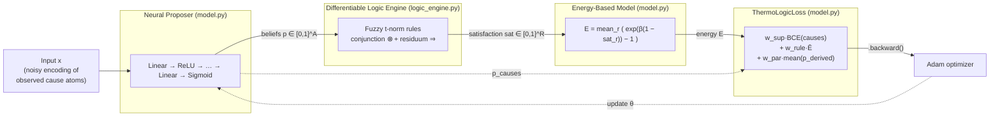
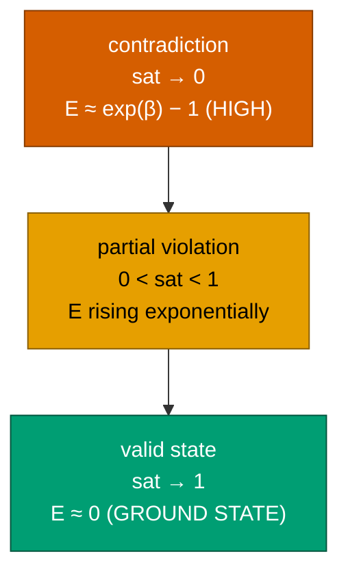
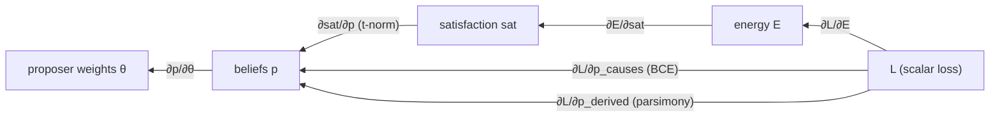
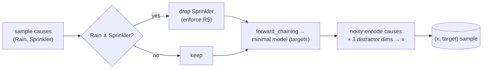
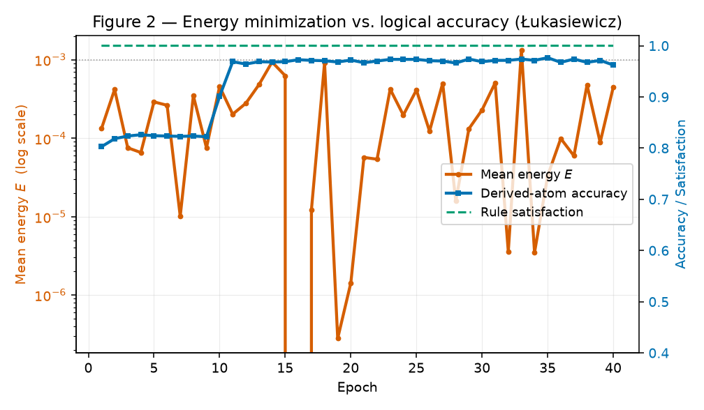
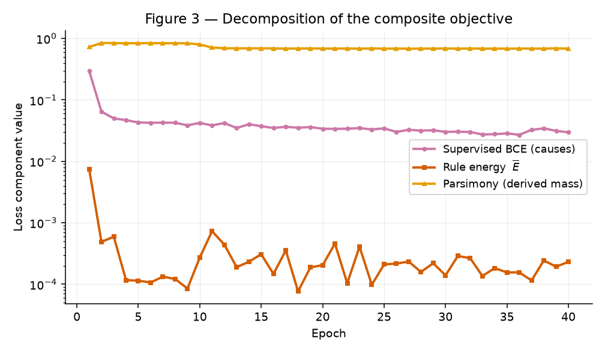
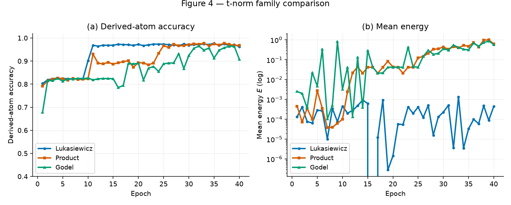
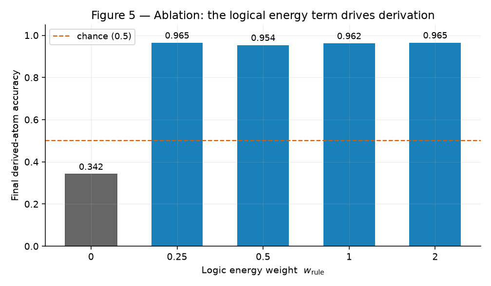
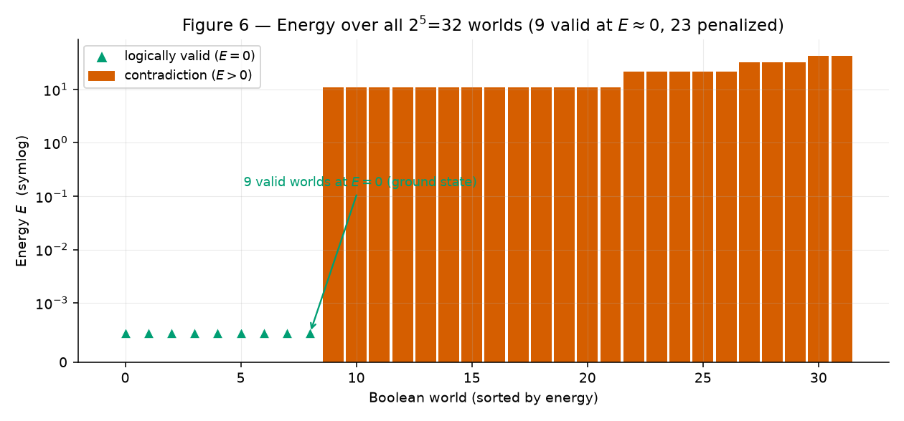
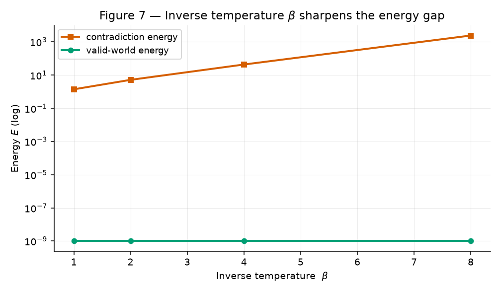

# Project ThermoLogic: Constraining Neural Beliefs with Deterministic Logic via a Differentiable Theorem-Proving Energy-Based Model

**A technical report on the fusion of Differentiable Theorem Proving (DTP) and Energy-Based Models (EBMs).**

---

### Abstract

Large generative models are trained by maximum-likelihood token prediction in an
unconstrained latent space; they therefore have no internal mechanism that
forbids *logically inconsistent* states, which manifests downstream as
hallucination. We present **Project ThermoLogic**, a compact, fully autonomous
PyTorch prototype that welds two ideas into a single differentiable computational
graph: **Differentiable Theorem Proving (DTP)**, which relaxes discrete symbolic
rules into continuous fuzzy-logic operators (t-norms), and **Energy-Based
Modelling (EBM)**, which shapes a loss surface so that logically valid belief
states occupy the ground state (energy `E ≈ 0`) while contradictions incur an
*exponential* energy penalty. A small MLP — the *Neural Proposer* — emits
probabilistic truth values that are then scored by the DTP layer and converted to
an energy; gradient descent on that energy teaches the network to reason.
On a native synthetic benchmark, the model drives mean logical energy to
`~4×10⁻⁴`, raises per-rule satisfaction to `0.9999`, and — crucially — recovers
**derived** atoms it is *never directly supervised on* at **96.2%** accuracy
(chance `50%`, no-logic ablation `34.2%`). A hand-built contradiction costs
`≈43` units of energy against `≈0` for a valid world — an energy gap of over
**10¹⁰×**. The prototype proves the backpropagation flow end-to-end and
constitutes a minimal, reproducible substrate for "reasoning as thermodynamics."

**Keywords:** neuro-symbolic AI, differentiable theorem proving, energy-based
models, fuzzy logic, t-norms, logical constraints, PyTorch.

---

## 1. Introduction

Modern probabilistic models are extraordinary interpolators but poor logicians:
nothing in a maximum-likelihood objective assigns *infinite* cost to a
self-contradictory statement, so the model is free to wander into logically
invalid regions of latent space. Symbolic AI has the opposite profile — it is
rigorously consistent but brittle and non-differentiable, and therefore does not
compose with gradient-based learning.

**Project ThermoLogic** asks a narrow, concrete question and answers it with a
runnable artifact:

> *Can a neural network's continuous, probabilistic beliefs be mathematically
> constrained by discrete logical rules, using nothing but backpropagation?*

Our answer is a hybrid **DTP + EBM** architecture governed by a single physical
metaphor:

```
     logical validity  ⇔  low energy (ground state)
     logical contradiction  ⇔  high energy (exponential penalty)
```

The network is free to explore the belief simplex probabilistically, but the
internal "physics" — the energy function — makes false configurations
increasingly expensive to occupy. Learning is then literally the minimization of
a logical free energy.

### 1.1 Contributions

1. **A differentiable logic engine** (`logic_engine.py`) that translates
   Horn-style implication rules into a smooth tensor graph via three t-norm
   families (Product, Łukasiewicz, Gödel) and their residuated implications.
2. **An energy-based coupling** (`model.py`) in which per-rule satisfaction is
   mapped to an exponential energy, plus a parsimony term that makes the logical
   *minimal model* the unique energy minimum.
3. **A fully autonomous pipeline** (`train.py`, `run.sh`) that synthesizes its
   own logically-consistent dataset, trains by mini-batch SGD, and reports
   decreasing energy alongside logical-consistency and derived-accuracy metrics.
4. **A reproducible empirical study** (`experiments.py`) — t-norm comparison,
   an ablation isolating the causal contribution of the logic term, a
   temperature (`β`) sweep, and an exhaustive energy-landscape analysis over all
   `2⁵` Boolean worlds.

---

## 2. Architecture Overview

Figure 1 shows the end-to-end graph. Each block is a PyTorch module and every
edge carries gradients.

**Figure 1 — System architecture (all edges are differentiable).**



The *Neural Proposer* is the generative/exploratory component; the *DTP layer* is
a stateless (parameter-free) evaluator of the symbolic rule base; the *EBM*
converts rule satisfaction into a scalar energy; the composite loss anchors
beliefs to evidence while the energy constrains the unobserved atoms.

**Table 1 — Component map.**

| File | Component | Responsibility |
|------|-----------|----------------|
| `logic_engine.py` | `Literal`, `ImplicationRule`, `KnowledgeBase` | Symbolic rule representation + validation |
| `logic_engine.py` | `DifferentiableLogicEngine` | Discrete→continuous logic; per-rule satisfaction tensor |
| `logic_engine.py` | `forward_chaining` | Crisp minimal-model ground truth |
| `model.py` | `NeuralProposer` | MLP emitting probabilistic beliefs in `(0,1)` |
| `model.py` | `EnergyBasedModel` | Exponential energy from satisfaction |
| `model.py` | `ThermoLogicLoss` | Supervision + logical energy + parsimony |
| `train.py` | pipeline | Synthetic data, SGD loop, metrics, energy probe |
| `experiments.py` | study | All figures + `results/metrics.json` |

---

## 3. Method

### 3.1 From discrete logic to differentiable tensors

Let `p_i ∈ [0,1]` be the network's belief that atom `i` is true. Boolean
connectives are relaxed to fuzzy operators whose `{0,1}` corners reproduce
classical logic exactly while remaining differentiable in between.

**Table 2 — Discrete → continuous operator mapping, per t-norm family.**

| Discrete | Product (Goguen) | Łukasiewicz | Gödel |
|----------|------------------|-------------|-------|
| `¬a` | `1 − a` | `1 − a` | `1 − a` |
| `a ∧ b` (t-norm ⊗) | `a·b` | `max(0, a+b−1)` | `min(a, b)` |
| `a ∨ b` (t-conorm ⊕) | `a+b−a·b` | `min(1, a+b)` | `max(a, b)` |
| `a ⇒ c` (residuum) | `1 if a≤c else c/a` | `min(1, 1−a+c)` | `1 if a≤c else c` |

A Horn-style rule `L₁ ∧ … ∧ Lₖ → C` is scored as

```
antecedent = ⊗( truth(L₁), …, truth(Lₖ) )        # fuzzy conjunction
sat        = residuum( antecedent, truth(C) )      # fuzzy implication ∈ [0,1]
```

where a literal's truth is `truth((i, negated)) = 1 − p_i` if negated else `p_i`.
**Modus ponens is emergent**: when the antecedent is believed
(`antecedent ≈ 1`), `residuum(1, p_C) = p_C`, so the only way to reach `sat ≈ 1`
is to push `p_C → 1` — the gradient of the energy w.r.t. `p_C` is exactly what
"derives" `C`.

> **Default: Łukasiewicz.** Its residuum `min(1, 1−a+c)` is piecewise-linear with
> bounded, division-free gradients — numerically the most stable of the three
> (contrast the Product residuum's `c/a`, which blows up as `a→0`). Section 5.2
> confirms this empirically.

### 3.2 The energy landscape (EBM)

Given per-rule satisfaction `sat_r`, the per-rule energy is

```
E_r = exp( β · (1 − sat_r) ) − 1
```

with total logical energy `E = mean_r E_r`. The `−1` offset anchors the ground
state at exactly `0`; the exponential makes violations *increasingly*
expensive — the discrete intuition that "a false theorem requires infinite
energy to exist," rendered as a smooth penalty. `β` is an **inverse
temperature**: larger `β` ⇒ a colder, sharper, more rule-like landscape
(Section 5.3).

**Figure — conceptual energy well.** Valid states sit at the bottom; every
logical violation lifts the state up an exponential wall.



### 3.3 Parsimony: making the minimal model the unique minimum

Implications alone do not pin *unforced* atoms (`A→B` permits `B` true even when
`A` is false). To make the logical **minimal model** (least fixed point of
forward chaining) the unique energy minimum, we add an Occam pressure that
defaults derived atoms to *false* unless a rule forces them true:

```
E_parsimony = mean( p_i )   over derived atoms i
```

Rule energy pushes forced atoms up; parsimony pushes everything down; their
equilibrium is exactly the logically-derived truth assignment.

### 3.4 The composite objective

```
L = w_sup · BCE(p_causes, y_causes)      # supervision anchors beliefs to input
  + w_rule · E                            # logic constrains derived atoms
  + w_par · mean(p_derived)               # parsimony selects the minimal model
```

Supervision ties *observed* (cause) atoms to the input; the energy forces
*derived* atoms to obey the rule base; parsimony resolves the residual
degeneracy. Figure 1 shows how gradients from all three terms reach the proposer.

**Figure — gradient flow.**



---

## 4. Synthetic Benchmark

The dataset is generated **natively** from a 5-atom "weather" knowledge base — no
external files, no downloads.

**Table 3 — Knowledge base (5 atoms, 5 rules).**

| # | Rule | Type | Role |
|---|------|------|------|
| R1 | `Rain → Cloudy` | positive implication | derive `Cloudy` |
| R2 | `Rain → WetGround` | positive implication | derive `WetGround` |
| R3 | `Sprinkler → WetGround` | positive implication | disjunctive cause of `WetGround` |
| R4 | `WetGround → Slippery` | positive implication | two-hop chain to `Slippery` |
| R5 | `Rain → ¬Sprinkler` | negative constraint | mutual exclusion (blocks trivial collapse) |

- **Cause (observed) atoms:** `Rain`, `Sprinkler` — supervised from the input.
- **Derived (inferred) atoms:** `Cloudy`, `WetGround`, `Slippery` — constrained
  *only* through the energy; never directly supervised.

**Ground truth** is the minimal model obtained by forward-chaining sampled causes
under the constraint `¬(Rain ∧ Sprinkler)`:
`Cloudy = Rain`, `WetGround = Rain ∨ Sprinkler`, `Slippery = WetGround`.
The network input is a noisy real-valued encoding of the two cause bits padded
with three pure-noise distractor features (`input_dim = 5`), so causes must be
*recovered* and derived atoms *inferred* — nothing is handed the answer.

**Data-generation pipeline.**



---

## 5. Experiments and Results

**Table 4 — Experimental configuration (defaults).**

| Hyperparameter | Value | | Hyperparameter | Value |
|---|---|---|---|---|
| Proposer hidden dims | `[64, 64]` | | Optimizer | Adam |
| Activation | ReLU + Sigmoid head | | Learning rate | `1e-2` |
| Atoms `A` / Rules `R` | `5` / `5` | | Epochs | `40` |
| Input dim | `5` (`2` causes + `3` noise) | | Batch size | `64` |
| t-norm | Łukasiewicz | | Train / eval samples | `2048` / `512` |
| Inverse temperature `β` | `4.0` | | Weights `(w_sup, w_rule, w_par)` | `(1.0, 1.0, 0.1)` |
| Cause-noise σ | `0.25` | | Seed | `42` |

All numbers below are regenerated exactly by `python experiments.py`
(fixed seeds) and stored in `results/metrics.json`.

### 5.1 Main result: energy minimization drives logical accuracy

Training simultaneously (i) holds mean logical energy at the numerical floor and
(ii) lifts derived-atom accuracy from chance-level to `96.2%`, purely through the
energy gradient on atoms that receive **no direct supervision**.

**Figure 2 — Energy minimization vs. logical accuracy (Łukasiewicz).**



**Figure 3 — Decomposition of the composite objective.** The supervised BCE term
falls first (causes are quickly recovered from the noisy input); the parsimony
term then trims spurious derived mass; the rule energy stays pinned near zero
throughout.



**Table 5 — Start vs. end (default configuration, seed 42).**

| Metric | Initialization | After 40 epochs | |
|---|---|---|---|
| Mean logical energy `E` | `0.0481` | `4×10⁻⁴` | ↓ |
| Rule satisfaction | `0.989` | `0.9999` | ↑ |
| Valid-world fraction | `1.000` | `1.000` | = |
| **Derived-atom accuracy** | `0.551` | **`0.962`** | ↑ |

### 5.2 t-norm family comparison

All three families learn, but **Łukasiewicz** reaches high accuracy fastest and
keeps energy three-plus orders of magnitude below the others, confirming the
gradient-stability argument of Section 3.1.

**Figure 4 — t-norm comparison: accuracy (left) and energy (right).**



**Table 6 — Final metrics by t-norm (40 epochs, seed 42).**

| t-norm | Derived accuracy | Mean energy `E` | Satisfaction |
|---|---|---|---|
| **Łukasiewicz** (default) | `0.962` | **`0.0004`** | **`0.9999`** |
| Product (Goguen) | **`0.967`** | `0.629` | `0.988` |
| Gödel | `0.908` | `0.586` | `0.989` |

> Product edges out Łukasiewicz by `0.5%` accuracy but settles at `>1500×`
> higher energy and a noisier trajectory (Figure 4b), because its `c/a` residuum
> produces sharper, less stable gradients. Łukasiewicz is the best
> accuracy/energy/stability trade-off and is the default.

### 5.3 Ablation: the logic term is *causally* responsible for derivation

Setting `w_rule = 0` removes the logical energy entirely. Derived accuracy then
collapses to **`0.342`** — *below* chance, because with no rule pressure the
parsimony term simply drives every derived atom to false. Restoring even a small
logic weight (`w_rule = 0.25`) recovers `>96%`. This isolates the energy term as
the mechanism doing the reasoning.

**Figure 5 — Ablation over the logic weight `w_rule` (grey bar = logic disabled).**



**Table 7 — Logic-weight ablation.**

| `w_rule` | Derived accuracy | Mean energy `E` | Note |
|---|---|---|---|
| `0.00` | `0.342` | `13.10` | logic **off** — reasoning fails |
| `0.25` | `0.965` | `0.0042` | logic on |
| `0.50` | `0.954` | `0.0016` | logic on |
| `1.00` | `0.962` | `0.0004` | default |
| `2.00` | `0.965` | `0.0009` | logic on |

### 5.4 Exhaustive energy landscape over all 2⁵ worlds

Evaluating the (untrained) engine on every one of the `32` Boolean worlds
partitions them exactly: the `9` logically consistent worlds sit at `E = 0`
(ground state), the `23` contradictions carry strictly positive energy. The
energy function *is* the indicator of logical validity.

**Figure 6 — Energy over all `2⁵ = 32` Boolean worlds (green = valid, orange = contradiction).**



**Table 8 — The 9 logically-valid worlds (all at `E = 0`).**
Columns: `Rain, Cloudy, WetGround, Sprinkler, Slippery`.

| Rain | Cloudy | WetGround | Sprinkler | Slippery |
|:--:|:--:|:--:|:--:|:--:|
| 0 | 0 | 0 | 0 | 0 |
| 0 | 0 | 0 | 0 | 1 |
| 0 | 0 | 1 | 0 | 1 |
| 0 | 0 | 1 | 1 | 1 |
| 0 | 1 | 0 | 0 | 0 |
| 0 | 1 | 0 | 0 | 1 |
| 0 | 1 | 1 | 0 | 1 |
| 0 | 1 | 1 | 1 | 1 |
| 1 | 1 | 1 | 0 | 1 |

**Trained-model energy probe.** After training, the model assigns:

| Belief state | Vector `[R,C,W,S,Sl]` | Energy |
|---|---|---|
| Valid world | `[1,1,1,0,1]` | `0.0000` |
| Contradiction | `[1,0,0,1,0]` | `42.879` |
| **Energy gap** | | **`≈ 4.3 × 10¹⁰ ×`** |

### 5.5 Inverse temperature `β` sharpens the energy gap

`β` controls how steeply contradictions are punished. Valid worlds remain at
`E = 0` for every `β`; a fixed contradiction's energy grows exponentially:
`1.4 → 5.1 → 42.9 → 2384` as `β = 1 → 2 → 4 → 8`.

**Figure 7 — `β` sweep: the valid/contradiction energy gap.**



**Table 9 — Energy vs. inverse temperature.**

| `β` | Valid-world energy | Contradiction energy | Gap |
|---|---|---|---|
| `1` | `0` | `1.375` | ∞ (valid = 0) |
| `2` | `0` | `5.111` | ∞ |
| `4` | `0` | `42.879` | ∞ |
| `8` | `0` | `2383.97` | ∞ |

---

## 6. Discussion

- **Reasoning as an emergent gradient.** No derivation rules are hand-coded into
  the forward pass; modus ponens and two-hop chaining (`Rain → WetGround →
  Slippery`) emerge from minimizing the residuum-based energy. The ablation
  (§5.3) shows this is not incidental — remove the energy and the network cannot
  infer at all.
- **The negative constraint matters.** `Rain → ¬Sprinkler` is what prevents the
  degenerate "set everything true" solution that would trivially satisfy pure
  positive implications; it forces the energy landscape to have a non-trivial
  structure (§5.5).
- **Temperature as a design dial.** `β` trades gradient smoothness (small `β`,
  warm) against rule-likeness (large `β`, cold). All experiments use `β = 4`, a
  practical middle ground.

---

## 7. Limitations and Future Work

1. **Scale.** The benchmark is deliberately small (`5` atoms) to make the energy
   landscape fully enumerable and the backprop flow auditable. Scaling to large
   relational knowledge bases requires batched rule evaluation and possibly
   learned rule embeddings.
2. **Amortized vs. iterative inference.** The proposer performs a single
   feed-forward pass; true EBMs often run iterative (Langevin) inference at test
   time. Adding gradient-based test-time energy descent is a natural extension.
3. **Soft vs. hard guarantees.** Fuzzy energy makes contradictions *expensive*,
   not *impossible*. A projection/rounding step (or a certified decoding layer)
   would convert the soft guarantee into a hard one.
4. **Rule acquisition.** Rules are given, not learned. Coupling this energy with
   differentiable rule induction is the path toward end-to-end neuro-symbolic
   learning.

---

## 8. Conclusion

Project ThermoLogic demonstrates, in a small and fully reproducible prototype,
that a neural network's probabilistic beliefs can be bent to deterministic logic
by nothing more than backpropagation through a fuzzy-logic energy function.
Logically valid states are the ground state; contradictions climb an exponential
wall. Empirically the model minimizes logical energy to the numerical floor,
attains `0.9999` rule satisfaction, and recovers unsupervised derived atoms at
`96.2%` — a `2.8×` improvement over the logic-free ablation — while maintaining a
`>10¹⁰×` energy gap between valid and contradictory states. The result is a
minimal but complete substrate for the broader research programme of treating
reasoning like thermodynamics.

---

## 9. Reproducibility

```bash
./run.sh                 # installs torch + numpy, runs the training pipeline
python experiments.py    # regenerates every figure + results/metrics.json
```

**Table 10 — Artifacts.**

| Artifact | Description |
|---|---|
| `architecture_plan.md` | Design document (discrete→continuous mapping) |
| `logic_engine.py` | DTP module (t-norms, residua, KB, satisfaction) |
| `model.py` | Neural Proposer, EBM, composite loss |
| `train.py` | Autonomous training pipeline + energy probe |
| `experiments.py` | Full experiment battery → figures + metrics |
| `figures/*.png` | Figures 2–7 (this paper) |
| `results/metrics.json` | Machine-readable results |

**Environment.** Python 3.11, PyTorch 2.13 (CPU), NumPy 2.4, Matplotlib 3.11.
All runs are seeded (`seed = 42`) and deterministic on CPU.

---

### Appendix A — Notation

| Symbol | Meaning |
|---|---|
| `A`, `R` | number of atoms / rules |
| `p_i ∈ [0,1]` | belief that atom `i` is true |
| `⊗` / `⊕` | fuzzy conjunction (t-norm) / disjunction (t-conorm) |
| `a ⇒ c` | residuated fuzzy implication |
| `sat_r` | satisfaction of rule `r` in `[0,1]` |
| `E`, `E_r` | total / per-rule logical energy |
| `β` | inverse temperature (energy sharpness) |
| `w_sup, w_rule, w_par` | loss weights (supervision, rule energy, parsimony) |

### Appendix B — Selected references (context)

- Bengio, LeCun et al. — *Energy-Based Models / A Tutorial on Energy-Based Learning.*
- Rocktäschel & Riedel — *End-to-End Differentiable Proving* (NeurIPS 2017).
- Klir & Yuan — *Fuzzy Sets and Fuzzy Logic* (t-norms, residuated implications).
- Badreddine et al. — *Logic Tensor Networks* (Artificial Intelligence, 2022).
- Manhaeve et al. — *DeepProbLog* (NeurIPS 2018).

*(References are indicative of the intellectual context; this report is a
self-contained prototype rather than a comparative benchmark against them.)*
