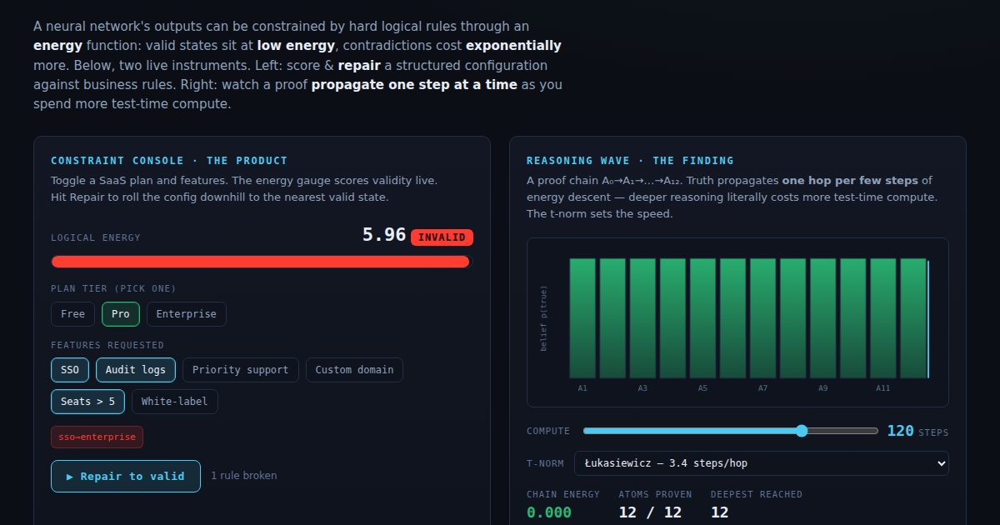

# Project ThermoLogic

[](https://github.com/joperjoker/Project-ThermoLogic/actions/workflows/ci.yml)
[](LICENSE)

**A differentiable logic-energy layer for AI outputs.** Drop it after any model
to *score* how much an output violates your hard rules (a label-free
inconsistency signal) and *repair* it to the nearest valid state — at a compute
budget you control.

> Reasoning as thermodynamics: logically valid outputs sit at **low energy**;
> contradictions cost **exponentially** more. "Thinking" is letting an answer roll
> downhill until it obeys the rules.

By **Teo Qing Cong Eugene** · [linkedin.com/in/eugene-teo](https://www.linkedin.com/in/eugene-teo)

📄 [Technical report](PAPER.md) · 📑 [PDF](ThermoLogic_TechnicalReport.pdf) · 📖 [Plain-English explainer](EXPLAINER.md) · 🕹️ [Live demo](https://joperjoker.github.io/Project-ThermoLogic/) · 🧭 [Walkthrough](WALKTHROUGH.md)

[](https://joperjoker.github.io/Project-ThermoLogic/)

---

## Quick start

```bash
pip install -e .                          # installs the thermologic package
```

```python
import torch
from thermologic import LogicEnergy, implies

guard = LogicEnergy(
    rules=[
        implies(["sso"], "plan_enterprise", name="sso⇒enterprise"),
        implies(["plan_free"], "seats_gt_5", negate_consequent=True, name="free⇒≤5 seats"),
    ],
    atom_names=["plan_free", "plan_enterprise", "sso", "seats_gt_5"],
)

out = torch.tensor([[1.0, 0.0, 1.0, 1.0]])   # free plan + SSO + >5 seats (invalid)
guard.score(out)        # -> tensor([...])  label-free inconsistency signal (>0)
guard.violations(out)   # -> [['sso⇒enterprise', 'free⇒≤5 seats']]
guard.repair(out, budget=60)              # soft: nearest rule-satisfying configuration
guard.repair(out, guarantee=True)         # hard: VERIFIED valid, or raises UnsatisfiableError
guard.solve({"sso_enabled": True})        # complete a partial config to a valid one
guard.satisfiability(out)                 # per-sample status: repaired / unsat (+ conflict core)
```

## What's inside

| Result (see the paper) | Product feature |
|---|---|
| Energy = logical inconsistency (label-free) | `score()` — a hallucination/trust signal, no ground truth needed |
| Test-time repair pulls outputs to validity | `repair()` — fix an output to the nearest valid state |
| Soft penalty → **hard guarantee** (§6.6) | `repair(guarantee=True)` / `solve()` — verified-valid or a *proof* of conflict |
| Reasoning depth = test-time compute | `budget=` — a "thinking" dial; deeper rules need more |

**Headline numbers** (11-atom benchmark, unseen-world test, 5 seeds): a plain
supervised net matches on accuracy (`0.955`) but its outputs are logically
*inconsistent* (energy `0.95`); ThermoLogic + repair reaches `0.971` at energy
`0.001` — the value is the **consistency guarantee**, not accuracy.

## Run everything

```bash
./run.sh                                 # autonomous training pipeline
python experiments.py                    # regenerate all figures + results/metrics.json
python experiments_baselines.py          # energy repair vs. projection baselines + scaling
python experiments_through_repair.py     # train THROUGH the repair (the differentiability win)
python experiments_supervision.py        # pre- vs post-repair supervision (honest null result)
python experiments_semisup.py            # logic as a semi-supervised loss on a hard rule (+26 pts)
python experiments_semanticloss.py       # novelty check: fuzzy energy vs. Semantic Loss + weight sweep (§5.11)
python benchmarks/cloud_config.py        # harder first-order-grounded benchmark (20 atoms, 432 worlds)
python benchmarks/latin_square.py        # external solver head-to-head where our method loses (§6.3)
python benchmarks/scaling.py             # measured scaling: Latin 3/4/5 + 9x9 Sudoku (§6.4)
python integration_demo.py               # LogicEnergy as a guardrail on a plain model (end-to-end)
python examples/llm_json_guardrail.py    # model-agnostic guardrail on LLM-style JSON output (§6.5)
python examples/config_validator.py      # worked use case: SaaS config validator
python -m unittest discover -s tests     # unit tests
```

## Reproducibility

Every figure and number regenerates from a named script (fixed seeds, CPU):

| Result | Script | Figure(s) |
|---|---|---|
| Core (wave, generalization, repair curve, baselines, robustness, t-norm, landscape) | `experiments.py` | `fig_depth_wave`, `fig_generalization`, `fig_repair_curve`, `fig_baselines`, `fig_robustness`, `fig_tnorm`, `fig_energy_landscape` |
| Energy repair vs. projection + scaling (§5.7) | `experiments_baselines.py` | `fig_projection_baseline` |
| Train through the repair (§5.8) | `experiments_through_repair.py` | — (console) |
| Pre- vs post-repair supervision, null (§5.9) | `experiments_supervision.py` | `fig_supervision` |
| Semi-supervised hard rule, +26 pts (§5.10) | `experiments_semisup.py` | `fig_semisup` |
| Novelty check vs. Semantic Loss + weight sweep (§5.11) | `experiments_semanticloss.py` | `fig_semanticloss`, `fig_semanticloss_weight` |
| Harder first-order-grounded benchmark (§6.1) | `benchmarks/cloud_config.py` | — (console) |
| End-to-end guardrail integration (§6.2) | `integration_demo.py` | `fig_integration` |
| External Latin-square solver head-to-head — an honest loss (§6.3) | `benchmarks/latin_square.py` | `fig_latin` |
| Measured scaling: projection vs. energy repair to 9×9 Sudoku (§6.4) | `benchmarks/scaling.py` | `fig_scaling` |
| Model-agnostic guardrail on LLM JSON (§6.5) | `examples/llm_json_guardrail.py` | — (console) |
| Plain-language slide charts | `assets/make_slide_figures.py` | `slide_depthwave`, `slide_baselines` |

Run everything at once: `./reproduce.sh`.

## Repository layout

| Path | Role |
|---|---|
| `thermologic/` | The library: `api.py` (`LogicEnergy`), `logic_engine.py` (DTP / t-norms), `model.py` (EBM, soft repair), `solver.py` (discrete hard-guarantee backstop), `data.py` |
| `examples/config_validator.py` | Worked use case — config validation via score/repair |
| `experiments.py` | Reproducible experiment battery → `figures/`, `results/metrics.json` |
| `train.py` · `run.sh` | Autonomous training pipeline |
| `tests/` | Unit tests (t-norms, energy, repair, API) |
| `PAPER.md` · `EXPLAINER.md` · `architecture_plan.md` | Technical report, plain-English version, design doc |
| `figures/` · `results/` | Generated charts and metrics |

## Scope

v1 targets **structured/tabular outputs with propositional rules** (config/form
validation, tabular decisions, data-integrity repair). General LLM-text
validation is roadmap, not a claim. This is an honest proof-of-concept and a small
usable tool — see the [technical report](PAPER.md) for the full, caveated story.

## License

MIT.
